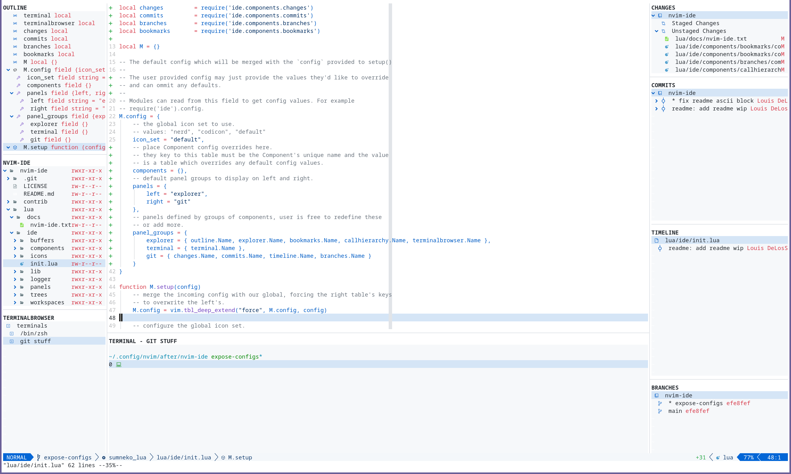

```  
███╗   ██╗██╗   ██╗██╗███╗   ███╗      ██╗██████╗ ███████╗
████╗  ██║██║   ██║██║████╗ ████║      ██║██╔══██╗██╔════╝
██╔██╗ ██║██║   ██║██║██╔████╔██║█████╗██║██║  ██║█████╗  
██║╚██╗██║╚██╗ ██╔╝██║██║╚██╔╝██║╚════╝██║██║  ██║██╔══╝  
██║ ╚████║ ╚████╔╝ ██║██║ ╚═╝ ██║      ██║██████╔╝███████╗
╚═╝  ╚═══╝  ╚═══╝  ╚═╝╚═╝     ╚═╝      ╚═╝╚═════╝ ╚══════╝
```


<p align="center">LazyVim + NVIM-IDE + Github NVIM Theme</p>

[Workflow Video](https://youtu.be/GcoHnB5DoFA)

`nvim-ide` is a complete IDE layer for Neovim, heavily inspired by `vscode`.

It provides a default set of components, an extensible API for defining your
own, IDE-like panels and terminal/utility windows, and the ability to swap between
user defined panels. 

This plugin is for individuals who are looking for a cohesive IDE experience 
from Neovim and are less concerned with mixing and matching from the awesome
ecosystem of Neovim plugins.

The current set of default components include:
* Bookmarks - Per-workspace collections of bookmarks with sticky support.
* Branches  - Checkout and administer the workspaces's git branches
* Buffers   - Display and administer the currently opened buffers.
* CallHierarchy - Display an LSP's CallHierarchy request in an intuitive tree.
* Changes - Display the current git status and stage/restore/commit/amend the diff.
* Commits - Display the list of commits from HEAD, view a read only diff or checkout a commit and view a modifiable diff.
* Explorer - A file explorer which supports file selection and recursive operations.
* Outline - A real-time LSP powered source code outline supporting jumping and tracking.
* TerminalBrowser - A terminal manager for creating, renaming, jumping-to, and deleting terminal instances.
* Timeline - Displays the git history of a file, showing you how the file was manipulated over several commits.

We put a lot of efforts into writing `docs/nvim-ide.txt`, so please refer to this 
file for introduction, usage, and development information.

## Getting started 

**Ensure you have Neovim v0.8.0 or greater.**

1. Get the plugin via your favorite plugin manager.

[Plug](https://github.com/junegunn/vim-plug):
```
Plug 'ldelossa/nvim-ide'
```

[Packer.nvim](https://github.com/wbthomason/packer.nvim): 
```
use {
    'ldelossa/nvim-ide'
}
```

2. Call the setup function (optionally with the default config):

```lua
-- default components
local bufferlist      = require('ide.components.bufferlist')
local explorer        = require('ide.components.explorer')
local outline         = require('ide.components.outline')
local callhierarchy   = require('ide.components.callhierarchy')
local timeline        = require('ide.components.timeline')
local terminal        = require('ide.components.terminal')
local terminalbrowser = require('ide.components.terminal.terminalbrowser')
local changes         = require('ide.components.changes')
local commits         = require('ide.components.commits')
local branches        = require('ide.components.branches')
local bookmarks       = require('ide.components.bookmarks')

require('ide').setup({
    -- The global icon set to use.
    -- values: "nerd", "codicon", "default"
    icon_set = "default",
    -- Set the log level for nvim-ide's log. Log can be accessed with 
    -- 'Workspace OpenLog'. Values are 'debug', 'warn', 'info', 'error'
    log_level = "info",
    -- Component specific configurations and default config overrides.
    components = {
        -- The global keymap is applied to all Components before construction.
        -- It allows common keymaps such as "hide" to be overridden, without having
        -- to make an override entry for all Components.
        --
        -- If a more specific keymap override is defined for a specific Component
        -- this takes precedence.
        global_keymaps = {
            -- example, change all Component's hide keymap to "h"
            -- hide = h
        },
        -- example, prefer "x" for hide only for Explorer component.
        -- Explorer = {
        --     keymaps = {
        --         hide = "x",
        --     }
        -- }
    },
    -- default panel groups to display on left and right.
    panels = {
        left = "explorer",
        right = "git"
    },
    -- panels defined by groups of components, user is free to redefine the defaults
    -- and/or add additional.
    panel_groups = {
        explorer = { outline.Name, bufferlist.Name, explorer.Name, bookmarks.Name, callhierarchy.Name, terminalbrowser.Name },
        terminal = { terminal.Name },
        git = { changes.Name, commits.Name, timeline.Name, branches.Name }
    },
    -- workspaces config
    workspaces = {
        -- which panels to open by default, one of: 'left', 'right', 'both', 'none'
        auto_open = 'left',
    },
    -- default panel sizes for the different positions
    panel_sizes = {
        left = 30,
        right = 30,
        bottom = 15
    }
})
```

3. Issue the "Workspace" command to begin discovering what's available.

4. Begin reading ":h nvim-ide"

## Best used with

`nvim-ide` is best used with:

fuzzy-searching:

- [Telescope.nvim](https://github.com/nvim-telescope/telescope.nvim)
- [fzf-lua](https://github.com/ibhagwan/fzf-lua)

pretty notifications:

- [nvim-notify](https://github.com/rcarriga/nvim-notify)

vscode-like "peek":
- [glance.nvim](https://github.com/DNLHC/glance.nvim)

deeper git integration:
- [gitsigns](https://github.com/lewis6991/gitsigns.nvim)

debugging:
- [nvim-dap](https://github.com/mfussenegger/nvim-dap)
- [nvim-dap-ui](https://github.com/rcarriga/nvim-dap-ui)
